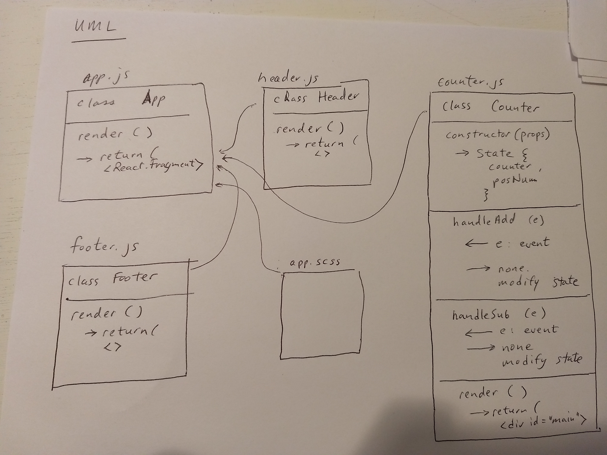

 LAB
=================================================

## Lab 26 - Component Based UI - React.js

### Author: Kevin O'Halloran

### Links and Resources
* [warmup](https://repl.it/@Kevinoh47/destructuring-and-spread)
* [sandbox](https://codesandbox.io/s/zw67yx84rp)
* [repo](https://github.com/Kevinoh47/lab-26/tree/working26)

### Modules

#### `app.js`
##### Exported Values and Methods
exports default App. 
The App class extends React.Component
###### `render() -> React.Fragment`
The app class renders a React.Fragment, composed of other fragments, building the final page.

#### `counter.js`
##### Exported Values and Methods
exports default Counter
the Counter class extends React.Component
###### `render() -> React.Fragment`
The render function renders a React.Fragment, which is the main section of the Counter application. It contains buttons / links for incrementing and decrementing the counter, handlers for the buttons /links, and stateful values of counter and posNum.
###### `handleAdd(e) -> nothing (state updated)`
The handleAdd event handler function takes an onClick event, and manages the state of the counter by incrementing the counter and testing whether the new number is positive or negative.
###### `handleSub(e) -> nothing (state updated)`
The handleSub event handler function takes an onClick event, and manages the state of the counter by decrementing the counter and testing whether the new number is positive or negative.

#### `header.js`
##### `Exported Values and Methods
exports default Header
the Header class extends React.Component
###### `render() -> React.Fragment`
The render function returns static markup inside a React Fragment.

#### `footer.js`
##### `Exported Values and Methods
exports default Footer
the Footer class extends React.Component
###### `render() -> React.Fragment`
The render function returns static markup inside a React Fragment.

### Setup
No setup necessary in codesandbox.io
Dependencies include classnames for managing dynamic markup classes, react, react-dom, react-redux, react-router-dom, react-scripts, redux, and superagent.

#### UML

